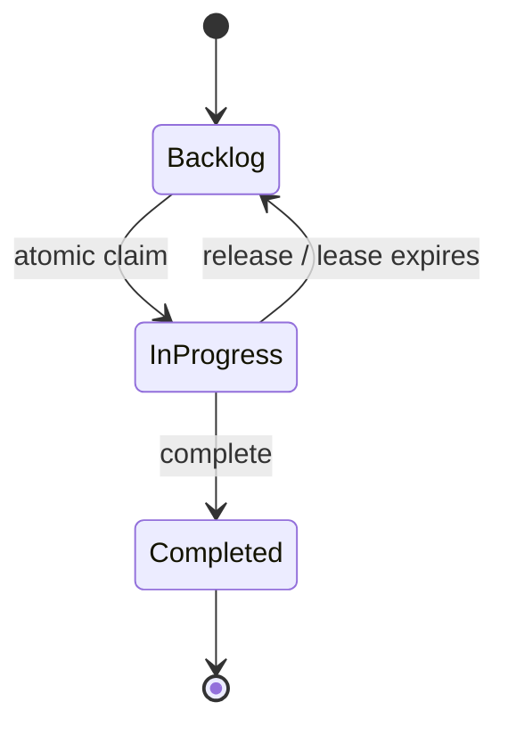

# Workstack Product Specification

## 1. Product summary

Workstack is development tooling for coordinating software work between a human operator and one or more coding agents.

A Workstack **project** has four principal forms of state:

1. **Project knowledge** — an LLM-wiki-style, AI-maintained Markdown knowledge base.
2. **Backlog work** — bugs, features and chores that have not yet been implemented.
3. **Active work** — backlog items currently claimed by coding agents.
4. **Completed work** — an append-only historical view of what was implemented, how, and by which agent/session.

The human primarily uses a native application. Coding agents primarily use an MCP server.

## 2. Problem statement

Coding agents are increasingly capable of implementing substantial work autonomously, but multi-agent development has three recurring problems:

- agents repeatedly rediscover architecture and past decisions;
- work to be done is not expressed in sufficiently implementation-ready form;
- multiple agents can unknowingly work on the same task at the same time.

Workstack addresses these by acting as a persistent project brain plus an agent-safe work queue.

## 3. Product goals

### G1 — Persistent project understanding
The project should accumulate durable knowledge that is useful to both humans and agents.

### G2 — High-quality work definition
A human can either create a work item directly or use AI planning to turn an idea into an implementation-ready task.

### G3 — Safe agent coordination
Agents can discover available work and atomically claim exactly one item without racing another agent.

### G4 — Closed knowledge loop
Completed work produces a structured completion record that can update the project knowledge base.

### G5 — Low ceremony
The application should feel like developer tooling, not enterprise project management.

## 4. Primary personas

### Human operator
- creates and manages projects;
- reviews backlog and active work;
- creates bugs/features manually;
- plans new work with AI;
- reviews completion history and project knowledge;
- occasionally releases or intervenes in stuck claims.

### Coding agent
- queries project knowledge;
- searches completed work for precedent;
- lists backlog items;
- reads a work item and its artifacts;
- atomically claims a work item;
- maintains its lease while working;
- completes, blocks or releases work;
- submits a completion summary.

## 5. V1 scope

### Projects
- create, edit and delete local Workstack projects;
- associate each project with a repository or project folder;
- show backlog, active and completed counts;
- open the associated project folder.

### Work items
Support types:
- Feature
- Bug
- Chore

Required properties:
- stable internal UUID;
- human-readable project sequence ID such as `WS-104`;
- title;
- Markdown description;
- acceptance criteria;
- type;
- priority: High / Normal / Low;
- status: Backlog / In Progress / Completed;
- attachments/artifacts;
- created/updated timestamps;
- source: manual / AI planning / MCP;
- completion record when completed.

### Attachments
The human can:
- drag files onto a work item;
- choose files using a picker;
- paste screenshots/images directly;
- preview attachments;
- remove attachments before or after creation.

Files must be stored within the Workstack project data directory and be available to coding agents.

### AI planning
- start a planning conversation for the current project;
- planner can retrieve relevant knowledge, backlog items and completed work;
- user can attach files/images to the planning session;
- planner progressively produces a Work Item Proposal;
- user can edit the proposal directly;
- user explicitly chooses `Add to Backlog`;
- planning never silently creates work.

### Knowledge
- Markdown-based knowledge wiki;
- semantic search experience;
- browse individual wiki articles;
- show raw sources/evidence used by the knowledge system;
- allow manual Markdown edits;
- completion records can become knowledge sources.

### MCP server
Must allow coding agents to:
1. search/query project knowledge;
2. search completed work;
3. list/query backlog items;
4. get full work-item details and artifacts;
5. atomically claim an item;
6. renew/heartbeat a claim;
7. release an item;
8. mark an item blocked;
9. complete an item with a structured completion record.

### Agent coordination
- only a Backlog item can be claimed;
- claiming must be atomic;
- successful claims return an opaque claim token;
- claim has a renewable expiry lease;
- completion/release/heartbeat operations require a valid claim token;
- expired leases make work reclaimable;
- UI displays the claiming agent/session and recent heartbeat state.

## 6. Work item lifecycle

`Blocked` is metadata/reason in V1, not a fourth permanent workflow column. A blocked active item may retain or release its claim depending on the agent action.

## 7. Key user stories

### Create work manually
As a user, I can create a feature/bug/chore with Markdown, acceptance criteria and artifacts so an agent has enough information to implement it.

### Plan work with AI
As a user, I can discuss a feature with an AI that already understands the project so I do not need to restate architecture, related work and prior decisions.

### Observe active work
As a user, I can immediately see which coding agents are working on which items and whether their leases are healthy.

### Query context
As a coding agent, I can retrieve relevant project knowledge and prior implementation work before making changes.

### Claim safely
As a coding agent, I can claim a backlog item and receive an unambiguous success/failure result so no two agents accidentally work on it.

### Complete and teach the project
As a coding agent, I can complete an item with a concise structured summary so future agents understand what changed and why.

## 8. UX qualities

Workstack should be:
- focused;
- information-dense but calm;
- keyboard friendly;
- native on macOS;
- clear about agent state;
- transparent about AI context;
- fast to navigate;
- free from project-management ceremony.

## 9. Success criteria for V1

V1 is successful when a user can perform this complete loop without leaving Workstack except for the coding agent itself:

1. create/open a project;
2. plan a feature with AI or create it manually;
3. add it to backlog;
4. agent discovers it via MCP;
5. agent claims it;
6. Workstack UI shows the active claim;
7. agent completes it;
8. completion details appear in Workstack;
9. completion is available as context for future searches/planning.
