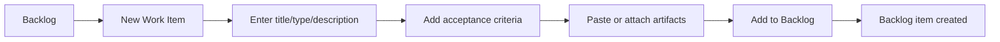
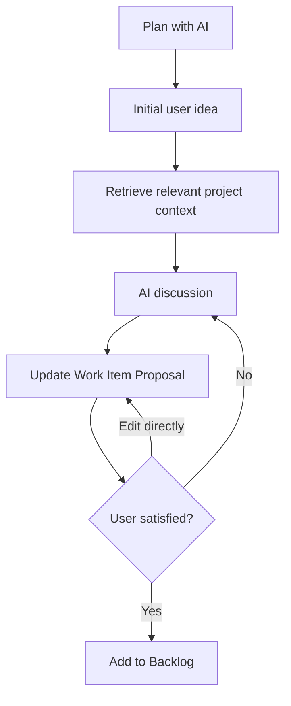
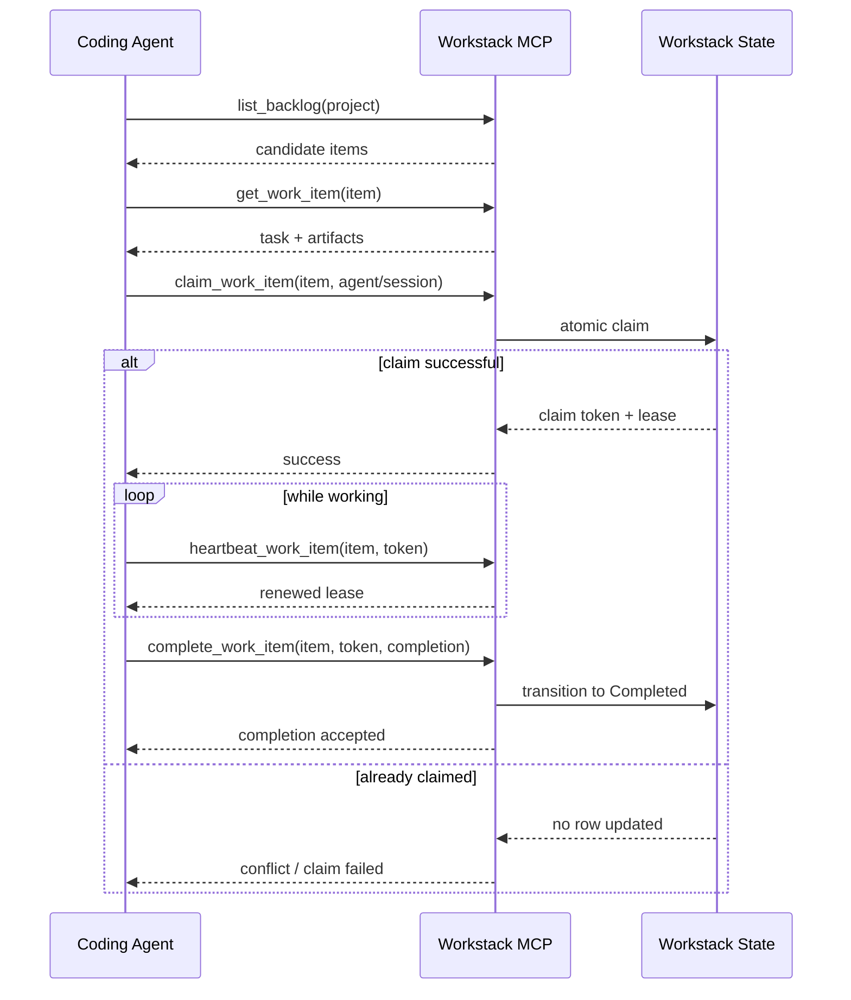
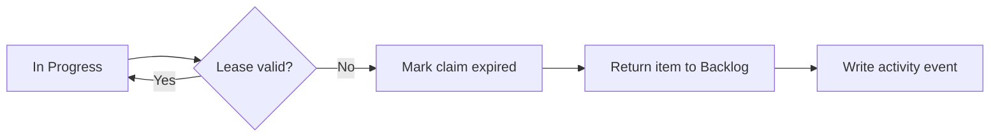
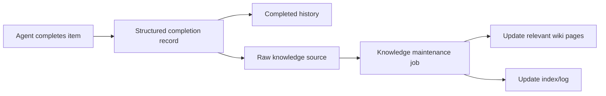

# Information Architecture and Core Flows

## 1. Navigation hierarchy

```text
Workstack
├── Projects/Home
└── Project
    ├── Overview
    ├── Backlog
    ├── In Progress
    ├── Completed
    ├── Knowledge
    │   ├── Articles
    │   └── Sources
    ├── Activity
    └── Project Settings
```

Transient surfaces:
- Create Project sheet
- New Work Item sheet
- Work Item detail window/page
- Plan with AI workspace
- Agent Detail sheet
- Attachment preview
- Global command palette
- Application Settings

## 2. Manual work-item creation flow



Validation:
- title required;
- project required;
- description may be short but should not be silently generated unless requested;
- attachments are persisted before transaction finalization or cleaned up if creation is cancelled.

## 3. AI planning flow



The planner may use:
- knowledge search results;
- completed work;
- current backlog;
- project metadata;
- attachments supplied during planning.

The planner must not create or mutate code.

## 4. Agent execution flow



## 5. Lease expiry flow



Expiry processing may occur lazily during API queries plus a periodic local cleanup task. Correctness must not depend exclusively on the timer running.

## 6. Completion-to-knowledge flow



Knowledge maintenance can be asynchronous inside the local app process, but UI must visibly distinguish:
- completion recorded;
- knowledge update pending;
- knowledge updated;
- knowledge update failed.

## 7. Global search flow

A single project search command may query:
- wiki articles;
- completed work;
- backlog/in-progress items.

Results should be grouped by source type and deep-link into the corresponding Workstack surface.
