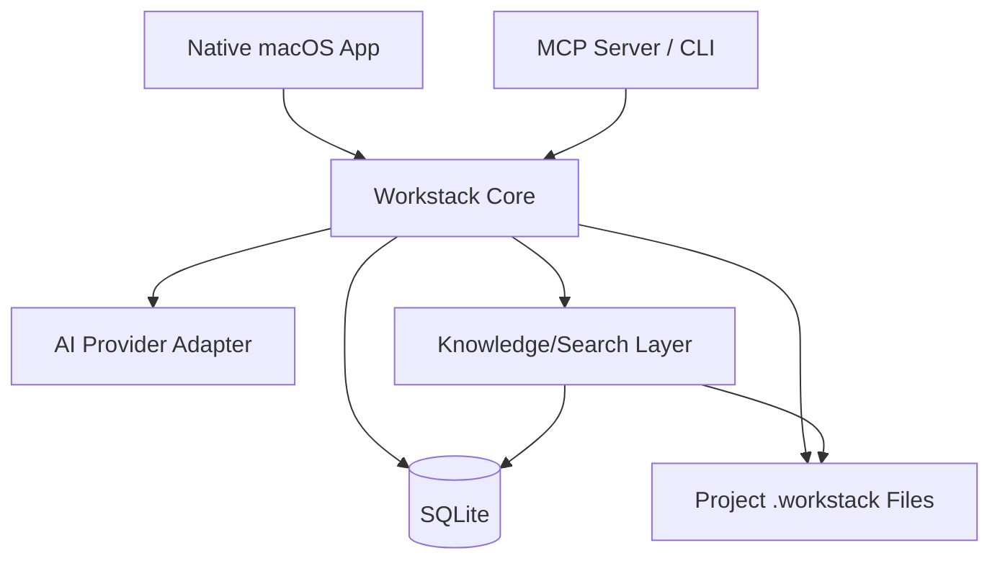

# Technical Architecture

## 1. Architectural objective

Keep operational state authoritative and safe for concurrent access while preserving project knowledge/artifacts as human-readable files.

The app UI and MCP server must not maintain independent copies of project state.

## 2. Logical architecture



## 3. Recommended V1 implementation shape

### Native application
- SwiftUI macOS application recommended;
- native sidebar/navigation split view;
- system file pickers, Quick Look and Keychain integrations;
- app can host the local core or share a core package with the MCP executable.

### Shared core
Implement a clear domain/repository layer that owns:
- project CRUD;
- work-item CRUD;
- status transitions;
- claim transactions;
- lease renewal and expiry;
- artifact paths;
- activity events;
- knowledge source registration;
- completion ingestion.

Exact language/package architecture can vary, but the business invariants in this spec must exist in one authoritative layer and be tested independently of UI.

### MCP executable
Provide a local `workstack-mcp` executable or equivalent that:
- communicates over MCP-supported local transport, initially stdio;
- opens the same project store safely;
- never bypasses core claim/status rules;
- emits structured errors suitable for agents.

### Storage
- SQLite for mutable/transactional state;
- filesystem for Markdown/wiki/raw sources/attachments;
- SQLite WAL mode recommended for concurrent app + MCP readers/writers;
- enable foreign keys;
- transactions around state transitions.

## 4. Local project layout

By default create a `.workstack/` directory inside the project folder. Allow a future setting to place metadata elsewhere.

```text
<project>/
├── .workstack/
│   ├── workstack.db
│   ├── project.json
│   ├── knowledge/
│   │   ├── schema.md
│   │   ├── index.md
│   │   ├── log.md
│   │   ├── wiki/
│   │   └── raw/
│   ├── work-items/
│   │   └── <work-item-uuid>/
│   │       ├── work-item.md
│   │       ├── completion.md
│   │       └── attachments/
│   └── logs/
└── source-code...
```

`work-item.md` and `completion.md` are exported/readable mirrors useful to agents and humans. SQLite remains authoritative for workflow state.

## 5. Project registry

The application needs a small user-level registry of known projects, separate from per-project state.

Example location:
`~/Library/Application Support/Workstack/projects.sqlite` or a lightweight JSON/SQLite registry.

Store:
- project UUID;
- display name;
- root path;
- last opened;
- optional icon metadata.

Do not duplicate backlog/work-item data in the global registry.

## 6. Concurrency

Correctness requirement:
- app and one or more MCP processes may access the same project at once;
- SQLite transaction semantics must protect claims and status transitions;
- no check-then-write race for claiming;
- all mutation functions validate expected current state.

## 7. Artifact handling

Artifacts are copied into the project Workstack directory rather than referenced by fragile external absolute paths.

Filename requirements:
- preserve original display filename;
- generate collision-safe stored filenames/IDs;
- record MIME/UTType, size, created timestamp and checksum when practical;
- never trust attachment filename as a path;
- prevent path traversal.

For pasted images:
- encode PNG by default unless preserving source format is straightforward;
- store then insert a relative reference into Markdown.

## 8. Search architecture

V1 may combine:
- SQLite FTS for titles/descriptions/completion text;
- Markdown/wiki full-text search;
- optional embeddings/vector index for semantic knowledge retrieval.

Create a provider abstraction so the semantic index can evolve without changing MCP/UI contracts.

Search result contract should return:
- source type;
- source ID/path;
- title;
- excerpt;
- relevance score if available.

## 9. AI provider abstraction

AI planning and wiki maintenance should not be tightly coupled to one model vendor.

Interface responsibilities:
- chat/completion request;
- tool/retrieval context injection;
- attachment/multimodal support when provider permits;
- cancellation;
- streaming tokens/events;
- usage/error telemetry.

Credentials must be stored via OS secure credential storage, not in project Markdown/SQLite plaintext unless unavoidable and explicitly disclosed.

## 10. Logging and observability

Local structured logs should include:
- MCP startup/shutdown;
- claim attempts and outcomes;
- lease heartbeats/expiry;
- DB migration errors;
- AI request failures without logging secrets;
- knowledge maintenance jobs.

Activity events visible to the user are separate from diagnostic logs.

## 11. Database migrations

Treat the database schema as versioned from the beginning.

Requirements:
- schema version table;
- forward migrations;
- backup/copy before destructive migration;
- project fails safely with a readable message if opened by incompatible older binaries.

## 12. Security/trust boundaries

- Project files and attachments may contain untrusted content.
- Never execute an attachment as part of indexing/preview.
- Sanitize Markdown rendering, particularly raw HTML/link handling.
- AI-produced text is data, not executable instructions.
- MCP callers may be autonomous; every mutation must enforce domain rules server-side.
- Claim token should be high-entropy and treated as a capability secret for the lifetime of the claim.
